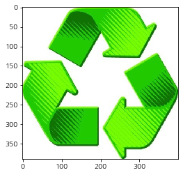

```python
from DpCycle.searchData.searchSE import SearchImgSE
from DpCycle import imgToArr
```


```python
search = SearchImgSE('깡통')
```


```python
search.naver_imgs_se(5)
```

    Collecting images...
    Downloading 5 images...
    success: img2019-08-06_171652_깡통0.jpeg
    success: img2019-08-06_171652_깡통1.jpeg
    success: img2019-08-06_171652_깡통2.jpeg
    success: img2019-08-06_171652_깡통3.jpeg
    success: img2019-08-06_171652_깡통4.jpeg
    
    5 files safely done
    


```python
search.daum_imgs_se(5)
```

    Collecting images...
    Downloading 5 images...
    success: img2019-08-06_171702_깡통0.jpeg
    success: img2019-08-06_171702_깡통1.jpeg
    success: img2019-08-06_171702_깡통2.jpeg
    success: img2019-08-06_171702_깡통3.png
    success: img2019-08-06_171702_깡통4.png
    
    5 files safely done
    


```python
search.google_imgs_se(5)
```

    Collecting images...
    Downloading 6 images...
    success: img2019-08-06_171721_깡통0.plain
    success: img2019-08-06_171721_깡통1.jpeg
    success: img2019-08-06_171721_깡통2.jpeg
    success: img2019-08-06_171721_깡통3.jpeg
    success: img2019-08-06_171721_깡통4.jpeg
    success: img2019-08-06_171722_깡통5.jpeg
    
    6 files safely done
    


```python
narr = search.naver_imgs_se(5, False)
narr.shape
```

    Collecting images...
    Downloading 5 images...
    


    (5,)


```python
narr[0]
```


    array([[[1., 1., 1., 1.],
            [1., 1., 1., 1.],
            [1., 1., 1., 1.],
            ...,
            [1., 1., 1., 1.],
            [1., 1., 1., 1.],
            [1., 1., 1., 1.]],
    
           [[1., 1., 1., 1.],
            [1., 1., 1., 1.],
            [1., 1., 1., 1.],
            ...,
            [1., 1., 1., 1.],
            [1., 1., 1., 1.],
            [1., 1., 1., 1.]],
    
           [[1., 1., 1., 1.],
            [1., 1., 1., 1.],
            [1., 1., 1., 1.],
            ...,
            [1., 1., 1., 1.],
            [1., 1., 1., 1.],
            [1., 1., 1., 1.]],
    
           ...,
    
           [[1., 1., 1., 1.],
            [1., 1., 1., 1.],
            [1., 1., 1., 1.],
            ...,
            [1., 1., 1., 1.],
            [1., 1., 1., 1.],
            [1., 1., 1., 1.]],
    
           [[1., 1., 1., 1.],
            [1., 1., 1., 1.],
            [1., 1., 1., 1.],
            ...,
            [1., 1., 1., 1.],
            [1., 1., 1., 1.],
            [1., 1., 1., 1.]],
    
           [[1., 1., 1., 1.],
            [1., 1., 1., 1.],
            [1., 1., 1., 1.],
            ...,
            [1., 1., 1., 1.],
            [1., 1., 1., 1.],
            [1., 1., 1., 1.]]], dtype=float32)


```python
import matplotlib.pyplot as plt
```


```python
plt.imshow(narr[0])
```


    <matplotlib.image.AxesImage at 0x16f7bd72780>


```python
import os
```


```python
file_list = [f'{path}/{file}' for path, _, files in os.walk('./imgs') for file in files]
file_list
```


    ['./imgs/img2019-08-04_013912_재활용0.png',
     './imgs/img2019-08-04_013913_재활용1.jpeg',
     './imgs/img2019-08-04_013913_재활용2.jpeg',
     './imgs/img2019-08-04_013913_재활용3.jpeg',
     './imgs/img2019-08-04_013913_재활용4.jpeg']


```python
import numpy as np
```


```python
narr = []
for f in file_list:
    arr = imgToArr.path_to_array(f)
    narr.append(arr)
    print(f'{type(arr)}  shape: {arr.shape}')
    
narr = np.array(narr)
narr.shape
```

    <class 'numpy.ndarray'>  shape: (494, 740, 4)
    <class 'numpy.ndarray'>  shape: (389, 400, 3)
    <class 'numpy.ndarray'>  shape: (218, 231, 3)
    <class 'numpy.ndarray'>  shape: (269, 282, 3)
    <class 'numpy.ndarray'>  shape: (379, 480, 3)
    


    (5,)


```python
plt.imshow(narr[1])
```


    <matplotlib.image.AxesImage at 0x16f7af1a6a0>





```python

```
